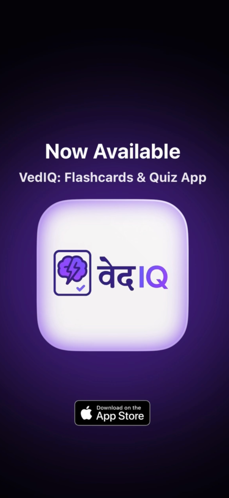

# 📚 VedIQ: Flashcard & Quiz App

> Smarter, faster learning — in seconds.

---

## ✨ What is VedIQ?

**VedIQ** is your personal learning companion that transforms dense study material into interactive flashcards and quizzes — in just seconds.

Whether you're:
- Preparing for a big exam,
- Acing an interview,
- Or simply leveling up your skills,

**VedIQ** makes it easier to understand and remember what matters most.

---

## 🚀 Features

- ✅ Turn **notes, PDFs, textbook images**, and **web links** into flashcards instantly.
- ✅ Auto-generated **quizzes and flashcards** using learning science.
- ✅ Built-in **spaced repetition** and **active recall** to help you retain more.
- ✅ Clean and distraction-free interface for efficient learning.
- ✅ Save and revisit flashcards anytime.

> 📌 **No more passive rereading — just tap, quiz, and remember.**

---

## 📱 Download the App

> 

---

## 🎬 Demo Video  

[Watch Demo](https://drive.google.com/file/d/1b_Pwn0XYOYufXxL7VqYZ2htcf9LKHIDO/view?usp=sharing)

---

## 🖼️ App Preview

  
  
  
  
  

---

## 🛠 Tech Stack

- **Language:** Swift  
- **Frameworks:** SwiftUI, AVFoundation, VisionKit  
- **APIs/Tools:** CoreML, UIKit, Xcode  

---

## 👥 Built With ❤️ By

- **Abhinav Gupta** ([GitHub](https://github.com/abhinav9573))  
- **Aditya Mathur** ([GitHub](https://github.com/adityam2003))  
- **Harshit Gupta** ([GitHub](https://github.com/harshitgupta0106))  

> A team project focused on turning study materials into smarter learning tools.

---

## 💡 Why VedIQ?

> “It's not the information that’s hard, it’s remembering it.”

VedIQ isn’t just another flashcard app. It helps you **actively engage** with your study material so you can learn more in less time.

---
## 🙌 Feedback & Suggestions

We’d love to hear from you!  
Open an issue or contact us for improvements and feedback.  
**Contact Us:** [vediq.app@gmail.com](mailto:vediq.app@gmail.com)

